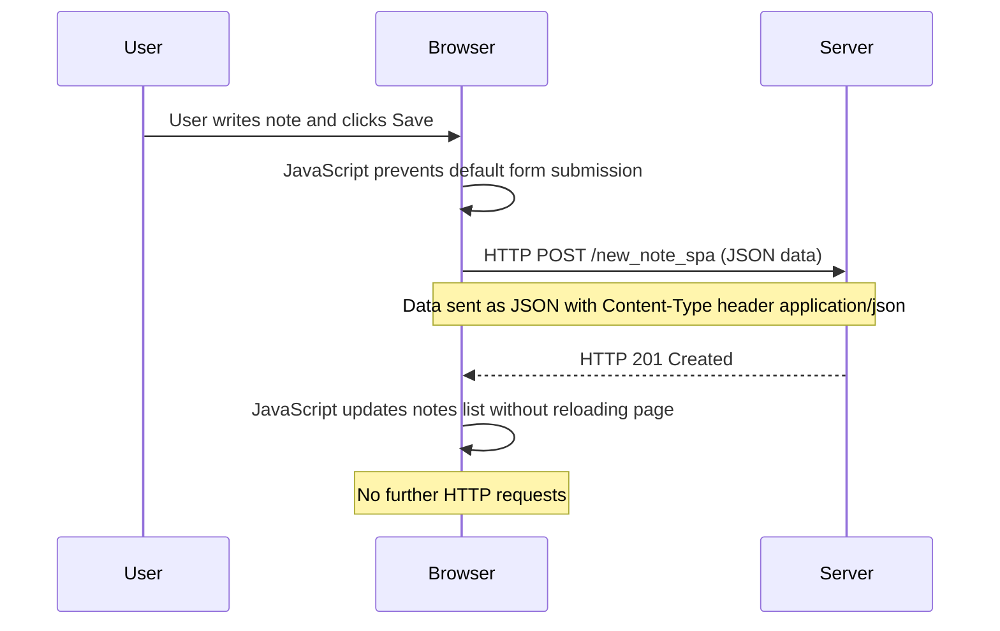

```mermaid
sequenceDiagram
    participant User
    participant Browser
    participant Server

    User->>Browser: User writes note and clicks Save
    Browser->>Browser: JavaScript prevents default form submission
    Browser->>Server: HTTP POST /new_note_spa (JSON data)
    Note over Browser, Server: Data sent as JSON with Content-Type header application/json
    Server-->>Browser: HTTP 201 Created
    Browser->>Browser: JavaScript updates notes list without reloading page
    Note over Browser: No further HTTP requests
```